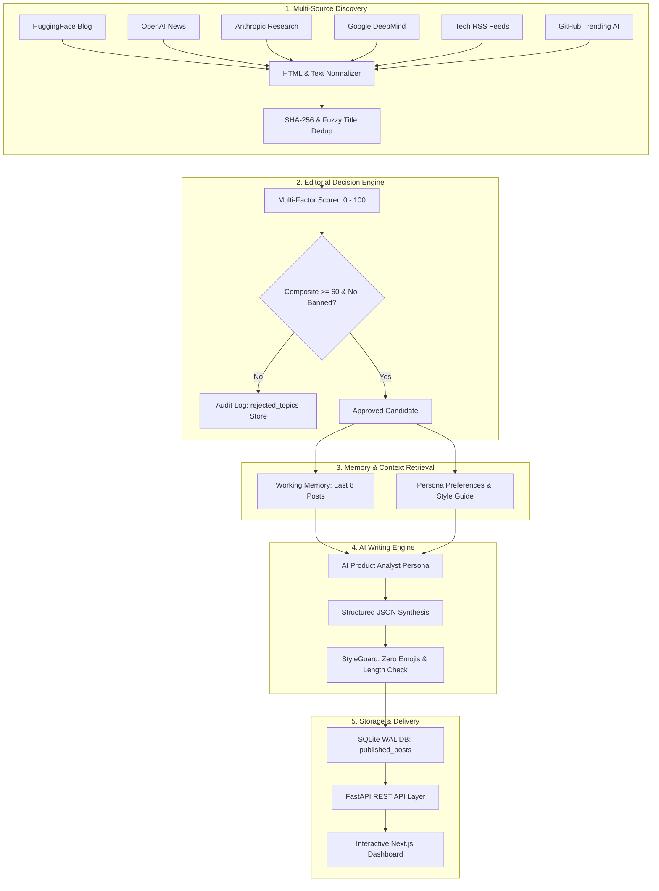

# ⚡ Autonomous AI Creator & Live Editorial Engine

[](https://fastapi.tiangolo.com)
[](https://www.python.org/)
[](https://www.sqlite.org/wal.html)
[](https://apscheduler.readthedocs.io/)
[](https://nextjs.org/)
[-brightgreen.svg?logo=pytest&logoColor=white)](https://docs.pytest.org/)
[](https://www.docker.com/)

An enterprise-grade, fully autonomous AI agent that continuously discovers frontier artificial intelligence research and news, applies calibrated mathematical editorial judgment, synthesizes high-signal takes in a calibrated persona voice, enforces strict guardrails (zero emojis, length checks, anti-duplication), and publishes to an interactive real-time dashboard.

---

## 🏛️ System Architecture



---

## 🔄 Autonomous 5-Step Workflow

Every 30 minutes (or on manual trigger), the background **APScheduler** executes an isolated autonomous cycle:

1. **Discovery**: Queries 6 independent AI channels (*Tech RSS, GitHub Trending AI, HuggingFace, OpenAI, Anthropic, DeepMind*), normalizes markup, and extracts canonical URLs and timestamps.
2. **Editorial Judgment**: Evaluates every candidate story with a multi-factor formula:
   $$\text{Score} = (0.35 \times \text{Relevance}) + (0.25 \times \text{Quality}) + (0.25 \times \text{Novelty}) + (0.15 \times \text{Recency})$$
   Hard vetoes automatically reject **advertisements**, **clickbait**, **blacklisted keywords**, **repeated news**, and **stale articles (>72h)**. Every decision is transparently recorded.
3. **Memory Retrieval**: Pulls recent published posts and active persona style guidelines to construct a non-repetitive prompt context.
4. **Persona-Calibrated Synthesis**: The **AI Product Analyst** persona generates a professional, educational, and opinionated synthesis in 2–3 short paragraphs with strict **zero-emoji** enforcement.
5. **Deduplication & Publishing**: Stores the final post into SQLite (`PRAGMA journal_mode=WAL`), index-validated with SHA-256 content hashes and sequence matchers to guarantee zero duplicates.

---

## 🛠️ Technology Stack

| Layer | Technologies | Purpose |
|---|---|---|
| **Backend API** | **FastAPI**, **Pydantic v2**, **Uvicorn** | High-performance async REST API with strict request validation |
| **Database & Memory** | **SQLite (WAL Mode)**, **SQLAlchemy ORM** | Zero-lock concurrent persistence for posts, persona, and audit logs |
| **Orchestration** | **APScheduler 3.10+** | Background scheduled cron/interval tasks with collision avoidance |
| **AI & Synthesis** | **OpenAI API (GPT-4o / Fallback)** | Calibrated structured JSON synthesis with StyleGuard gatekeeper |
| **Discovery & Parsing** | **HTTPX**, **Feedparser**, **BeautifulSoup4** | Multi-source scraping, HTML normalization, and GitHub API polling |
| **Frontend UI** | **Next.js 14**, **React 18**, **TypeScript**, **CSS Glassmorphism** | Real-time interactive dashboard, telemetry, and decision inspector |
| **Testing** | **Pytest**, **FastAPI TestClient** | Comprehensive 32-test unit and integration test suite |
| **Deployment** | **Docker**, **Docker Compose** | Single-command containerized production deployment |

---

## 📂 Project Folder Structure

```
ABtalks/
├── api/
│   ├── hackathon_api.py          # Standalone FastAPI endpoints (/api/agent/*)
│   ├── routes_agent.py           # SQLAlchemy-backed API router
│   └── schemas.py                # Pydantic v2 validation models
├── app/
│   ├── config.py                 # Pydantic BaseSettings environment loader
│   └── main.py                   # FastAPI application factory with CORS & static mounting
├── core/
│   ├── autonomous_scheduler.py   # APScheduler 30-minute interval background loop
│   ├── persona.py                # Persona system prompt builders & guardrails
│   └── scheduler.py              # Background orchestration service
├── db/
│   ├── database.py               # SQLite WAL connection engine
│   └── models.py                 # 6 SQLAlchemy ORM models (Config, Posts, Decisions, etc.)
├── discovery/
│   ├── ai_sources_fetcher.py     # Multi-source AI & GitHub trending discovery engine
│   ├── dedup.py                  # SHA-256 & fuzzy sequence deduplication
│   ├── news_fetcher.py           # RSS & NewsAPI multi-channel scrapers
│   └── normalizer.py             # HTML tag stripper & date normalizer
├── editorial/
│   ├── editorial_decision_engine.py # 0-100 multi-factor scorer & rejection filter
│   ├── decision_engine.py        # Editorial evaluator
│   ├── rationale_builder.py      # Transparent explanatory bullet point generator
│   └── scorer.py                 # Relevance, Novelty, and Recency math models
├── generation/
│   ├── ai_writing_engine.py      # AI Product Analyst writer with zero-emoji guard
│   ├── content_generator.py      # Structured JSON LLM synthesizer
│   ├── prompt_templates.py       # OpenAI JSON schemas & system prompts
│   └── style_guard.py            # Quality, length, and repetition validator
├── memory/
│   ├── sqlite_memory_system.py   # SQLite memory store, audit logs & context builder
│   ├── retrieval.py              # Working memory fetcher
│   └── summarizer.py             # Long-term thematic memory compaction
├── frontend/
│   ├── src/app/
│   │   ├── layout.tsx            # Next.js font & metadata wrapper
│   │   ├── page.tsx              # Reactive dashboard, Feed, and Rejected Topics UI
│   │   └── globals.css           # Modern dark glassmorphism design system
│   ├── src/lib/                  # TypeScript interfaces & async API client
│   ├── package.json              # Next.js dependencies
│   └── next.config.mjs           # API reverse proxy configuration
├── static/
│   ├── index.html                # Built-in live browser dashboard served by FastAPI
│   ├── style.css                 # Glassmorphism stylesheet
│   └── app.js                    # Auto-refresh controller & modal logic
├── tests/
│   ├── test_discovery.py         # Ingestion, normalization & dedup tests
│   ├── test_memory.py            # SQLite WAL & memory tests
│   ├── test_editorial.py         # Rejection heuristics & scoring tests
│   ├── test_writer.py            # StyleGuard, formatting & no-emoji tests
│   ├── test_scheduler.py         # APScheduler 30-min loop tests
│   ├── test_api.py               # FastAPI endpoint tests
│   └── test_pipeline.py          # End-to-end integration test suite
├── Dockerfile                    # Containerization definition
├── docker-compose.yml            # Multi-service container orchestrator
├── requirements.txt              # Python production dependencies
└── README.md                     # Project documentation
```

---

## 🚀 Installation & Getting Started

### 1. Prerequisites
- **Python 3.11+** installed
- Optional: **Node.js 18+** (for Next.js frontend development)
- Optional: **Docker & Docker Compose**

### 2. Clone & Setup Virtual Environment
```bash
git clone https://github.com/your-username/autonomous-ai-creator.git
cd autonomous-ai-creator

# Create virtual environment
python -m venv venv

# Activate on Windows:
.\venv\Scripts\activate
# Activate on macOS/Linux:
source venv/bin/activate

# Install Python dependencies
pip install -r requirements.txt
```

### 3. Configure Environment Variables
Create a `.env` file in the root directory:
```env
OPENAI_API_KEY=your_openai_api_key_here
FALLBACK_MODEL=gpt-4o-mini
POSTING_INTERVAL_MINUTES=30
DAILY_POST_CAP=10
SQLITE_DB_PATH=data/autonomous_agent.db
PORT=8080
```
*(Note: If no OpenAI API key is provided, the system seamlessly uses its built-in deterministic synthesis engine for zero-cost offline execution!)*

### 4. Run the Application
Start the unified backend & live web dashboard:
```bash
uvicorn app.main:app --port 8080 --reload
```
Open **`http://localhost:8080`** in your browser to view the live dashboard.

---

## 📡 API Reference & Specifications

### 1. `POST /api/agent/init`
Initializes or reconfigures the agent persona and arms the background scheduler.

**Request Body:**
```json
{
  "persona_name": "AI Product Analyst",
  "persona_bio": "Evaluates frontier AI models and research through the lens of product strategy and unit economics.",
  "topics_of_interest": ["LLMs", "Autonomous Agents", "Robotics", "AI Safety"],
  "tone_traits": ["professional", "educational", "opinionated"],
  "writing_style_rules": ["2-3 short paragraphs", "No emojis", "Cite primary sources"],
  "banned_topics": ["crypto speculation", "clickbait", "celebrity gossip"],
  "posting_interval_minutes": 30,
  "daily_post_cap": 10,
  "force_reinit": false
}
```

**Responses:**
- `201 Created`: Persona successfully configured and scheduler armed.
- `409 Conflict`: Returned if already configured (pass `"force_reinit": true` to overwrite).
- `422 Unprocessable Entity`: Validation error on empty topics or invalid parameters.

---

### 2. `GET /api/agent/feed`
Retrieves published posts sorted newest-first.

**Query Parameters:**
- `limit` (default: 20, max: 100)
- `status` (default: `"published"`)

**Response (`200 OK`):**
```json
{
  "status": "active",
  "persona_name": "AI Product Analyst",
  "total_posts": 16,
  "daily_cap": 10,
  "posts": [
    {
      "id": "post_1786128602_04a03931",
      "title": "Strategic Analysis: Anthropic Introduces Model Context Protocol",
      "content": "Anthropic introduces Model Context Protocol (MCP) as an open standard for tool orchestration. While baseline model performance has largely commoditized, the operational differentiator is shifting toward test-time verification and deterministic tool orchestration.\n\nFrom a product perspective, shipping resilient AI systems requires prioritizing predictable latency and unit cost over unconstrained reasoning depth.",
      "rationale": "Product economics analysis of developer ergonomics and agent tool use.",
      "sources": ["https://www.anthropic.com/news/model-context-protocol"],
      "published_at": "2026-08-07T18:50:02Z"
    }
  ]
}
```

---

### 3. `GET /api/agent/status`
Returns real-time agent operational health, daily cap meter, and cycle metrics.

### 4. `GET /api/agent/decisions`
Returns the transparent audit log of evaluated and rejected candidate stories with their 4-factor scores and explicit rejection rationales.

### 5. `POST /api/agent/trigger`
Triggers an immediate autonomous discovery, editorial evaluation, and synthesis tick on demand.

---

## 🖼️ Dashboard & UI Previews

```
+-----------------------------------------------------------------------------------+
|  ⚡ AUTONOMOUS AI CREATOR                           [LIVE] Auto-Refresh: 5s ▾     |
+-----------------------------------------------------------------------------------+
|  [ TOTAL POSTS: 16 ]  [ DECISIONS: 50 ]  [ NEWS INGESTED: 50 ]  [ CAP: 10/10 ]    |
+-----------------------------------------+-----------------------------------------+
|  PERSONA DETAILS                        |  LIVE FEED / LATEST POSTS               |
|  Name: AI Product Analyst               |  -------------------------------------  |
|  Bio: Strategic evaluation of models... |  Strategic Analysis: Anthropic MCP      |
|  Tone: Professional, Educational        |  Anthropic introduces MCP as an open    |
|  Topics: [LLMs] [Agents] [Robotics]     |  standard for tool orchestration...     |
|  Banned: [Crypto] [Clickbait]           |  💡 Reason for Publishing ▾             |
|  [ ⚙️ Edit Persona ]                    |  Sources: [anthropic.com/mcp]           |
+-----------------------------------------+-----------------------------------------+
|  REJECTED TOPICS & STORIES AUDIT                                                  |
|  • Claim 50% Discount on AI Tools (Score: 42/100) -> [REJECT: Advertisement]      |
|  • Shocking Hollywood Secrets (Score: 46/100)    -> [REJECT: Clickbait phrasing]  |
|  • Handmade Italian Pasta (Score: 66/100)       -> [REJECT: Irrelevant non-AI]    |
|  • Perceptron Retrospective (Score: 53/100)     -> [REJECT: Old news >72h]        |
+-----------------------------------------------------------------------------------+
```

---

## 🧪 Automated Testing & Verification

The repository includes a comprehensive 32-test automated test suite:

```bash
# Run all unit and integration tests
python -m pytest -v
```

**Test Breakdown:**
- ✅ `tests/test_discovery.py` (6 tests) — HTML stripping, ISO parsing, SHA-256 deduplication
- ✅ `tests/test_memory.py` (6 tests) — SQLite WAL mode, persona persistence, duplicate prevention
- ✅ `tests/test_editorial.py` (7 tests) — Rejections for ads, clickbait, irrelevant, duplicate, and stale news
- ✅ `tests/test_writer.py` (4 tests) — AI Product Analyst tone, zero-emoji enforcement, short paragraphs
- ✅ `tests/test_scheduler.py` (2 tests) — 30-min APScheduler interval, collision-free execution
- ✅ `tests/test_api.py` (7 tests) — FastAPI status codes (`201`, `409`, `422`, `200`)

---

## 🐳 Docker Deployment

To launch the complete autonomous creator inside an isolated Docker container:

```bash
# Build and start via Docker Compose
docker-compose up --build -d

# View live background container logs
docker-compose logs -f
```

The database volume is persisted at `./data/autonomous_agent.db`.

---

## 🔮 Future Improvements & Roadmap

- [ ] **Multi-Agent Editorial Board**: Spawn specialized sub-agents (*e.g., Fact-Checker Agent, Unit Economics Critic, Safety Auditor*) to debate candidate stories before publication.
- [ ] **Automated Social Distribution**: Direct webhook dispatchers for LinkedIn, X (Twitter), Discord, and Slack channels.
- [ ] **Vector Embedding Search**: Augment SQLite memory with ChromaDB / FAISS for deep semantic recall across historical publications.
- [ ] **Audience Engagement Feedback Loop**: Ingest post analytics (likes, shares, click-throughs) to dynamically adjust editorial topic weights.
- [ ] **Multimodal Visual Synthesis**: Automatically generate clean architecture diagrams and infographics for published takes.

---

## 📄 License
MIT License. Built for the Autonomous AI Creator Hackathon.
